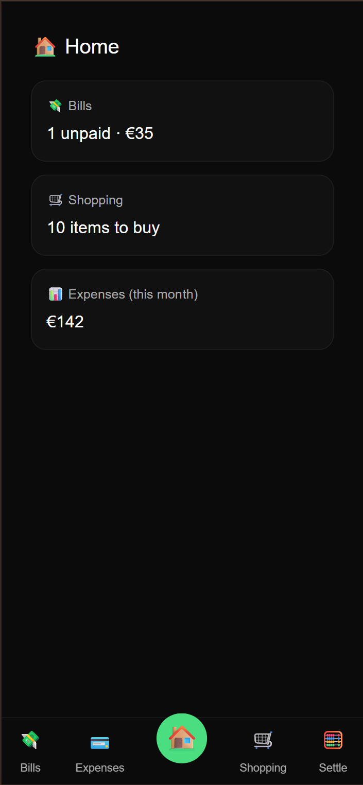
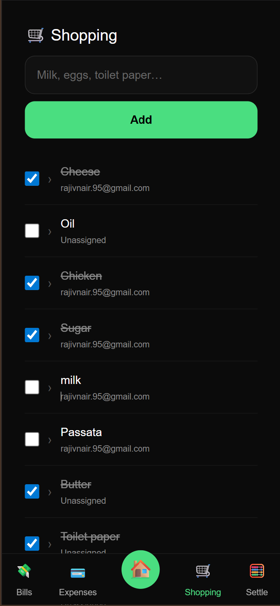
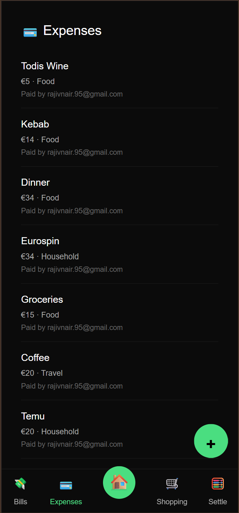
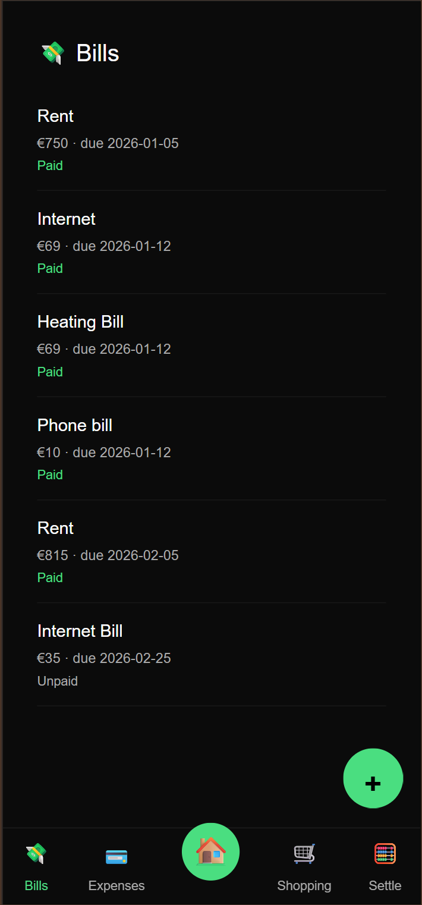
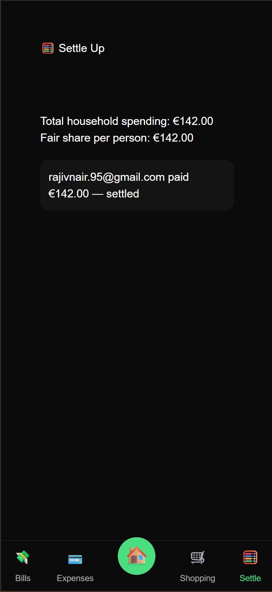

# 🏠 Home Tracker

A shared household management web app built to track **shopping lists, expenses, bills, and settlements** between housemates — designed mobile-first and installable as a PWA.

🔗 Live App: https://home-tracker-ebon.vercel.app/

---

## ✨ Features

### 🛒 Shopping List
- Add items to a shared shopping list
- Assign items to a housemate
- Mark items as bought
- Edit existing items
- Real-time sync between users

### 💳 Expenses
- Log daily expenses
- Assign who paid
- Categorize expenses (Food, Household, Travel, etc.)
- Edit existing expenses
- Monthly expense overview

### 💸 Bills
- Track recurring bills (Rent, Internet, Utilities, etc.)
- Set due dates
- Mark bills as paid/unpaid
- Overdue bill indicators
- Edit bill details

### 🧮 Settle Up
- Automatically calculates:
  - Total household spending
  - Fair share per person
  - Who owes whom and how much

### 📱 Mobile-First PWA
- Installable on iOS & Android
- Smooth app-like navigation
- Bottom navigation bar for quick access
- Works great on mobile screens

---

## 🛠 Tech Stack

- **Frontend:** Next.js 16 (App Router), TypeScript
- **Backend:** Supabase (Postgres, Auth, Realtime)
- **Auth:** Supabase Email Auth
- **Styling:** Custom mobile-first UI
- **Hosting:** Vercel
- **Database:** PostgreSQL (via Supabase)

---

## 📸 Screenshots

| Home Dashboard | Shopping | Expenses | Bills | Settle Up |
|----------------|----------|----------|-------|-----------|
|  |  |  |  |  |


---

## 🚀 Installation (Local)

```bash
git clone https://github.com/rajiv-writer/home-tracker.git
cd home-tracker
npm install
npm run dev


Create a .env.local file with:

NEXT_PUBLIC_SUPABASE_URL=your_url
NEXT_PUBLIC_SUPABASE_ANON_KEY=your_key

🔮 Roadmap (V2 Ideas)

Analytics dashboard (monthly insights)

Notifications for upcoming bills

Expense charts & breakdowns

Household roles (admin/member)

Export data (CSV / PDF)

👋 Author

Rajiv Ravindran
Writer • Data Engineer • Product Builder

This project was built as a practical exploration of product thinking, full-stack development, and household finance workflows.